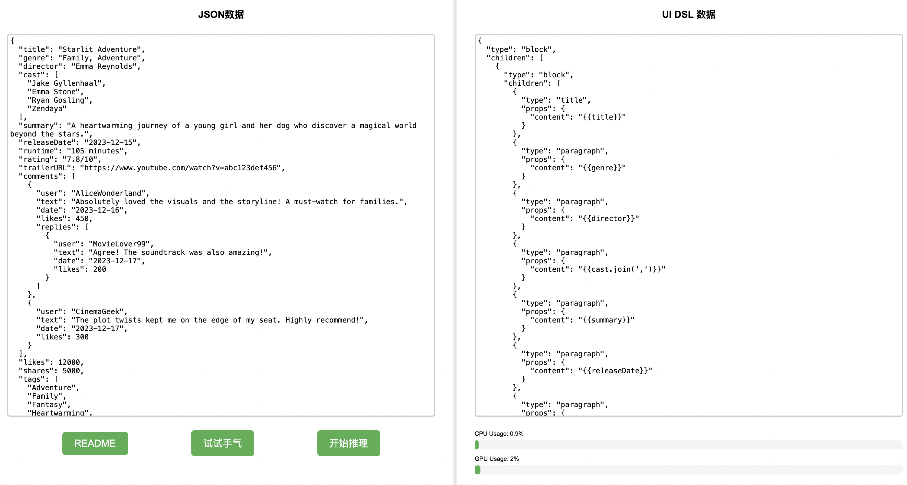
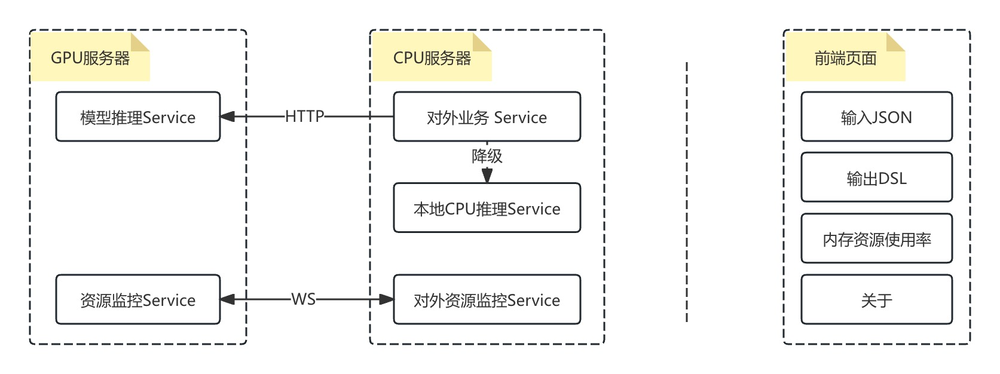

<p>
  <strong>👀 :</strong>
  
</p>


+ html访问环境：http://127.0.0.1:8888/dsl/test
+ API接口:http://127.0.0.1:8099/dsl2
    + 请求方式：post提交，参数为form-data格式，参数名为data,值为jsonstring
    + curl url 示范例子(注意jsonstring转义问题)：
        ```
        curl -X POST http://127.0.0.1:8099/dsl2 -d "data={\"a\":{\"b\":\"图片\",\"c\":[{\"d\":\"https://example.com/image1.jpg\",\"e\":\"风景\",\"f\":{\"g\":\"自然\",\"h\":\"山景\"}},{\"d\":\"https://example.com/image2.jpg\",\"e\":\"人物\",\"f\":{\"g\":\"肖像\",\"h\":\"微笑\"},\"i\":{\"j\":\"摄影师\",\"k\":\"张三\"}}]},\"l\":{\"m\":\"新闻\",\"n\":[{\"o\":\"国际\",\"p\":\" 俄乌冲突\",\"q\":\"最新进展\",\"r\":\"紧张局势升级\"},{\"o\":\"科技\",\"p\":\"AI发展\",\"q\":\"突破\",\"s\":\"自动驾驶\"}],\"t\":{\"u\":\"国内\",\"v\":\"经济\",\"w\":\"政策调整\",\"x\":\"促进增长\"}},\"y\":{\"z\":\"关于我们\",\"aa\":\"公司简介\",\"ab\":\"我们是一家专注于科技创新的公司\",\"ac\":{\"ad\":\"团队\",\"ae\":\"精英\",\"af\":\"专业\",\"ag\":\"热情\"},\"ah\":{\"ai\":\"联系方式\",\"aj\":\"电话\",\"ak\":\"123-456-7890\",\"al\":\"邮箱\",\"am\":\"info@example.com\"}},\"an\":{\"ao\":\"产品列表\",\"ap\":[{\"aq\":\"产品1\",\"ar\":\"智能音箱\",\"as\":\"https://example.com/product1.jpg\",\"at\":\"语音助手\"},{\"aq\":\"产品2\",\"ar\":\"智能手表\",\"as\":\"https://example.com/product2.jpg\",\"at\":\"健康监测\"},{\"aq\":\"产品3\",\"ar\":\"智能眼镜\",\"as\":\"https://example.com/product3.jpg\",\"at\":\"AR体验\",\"au\":{\"av\":\"特色\",\"aw\":\"高清显示\"}}]}}"
        ```
    + python 
        
        ```  
        import json
        import requests
        url = "http://127.0.0.1:8099/dsl2"
        data = {
            "a": {
                "b": "图片",
                "c": [{
                    "d": "https://example.com/image1.jpg",
                    "e": "风景",
                    "f": {
                        "g": "自然",
                        "h": "山景"
                    }
                }, {
                    "d": "https://example.com/image2.jpg",
                    "e": "人物",
                    "f": {
                        "g": "肖像",
                        "h": "微笑"
                    },
                    "i": {
                        "j": "摄影师",
                        "k": "张三"
                    }
                }]
            },
            "l": {
                "m": "新闻",
                "n": [{
                    "o": "国际",
                    "p": " 俄乌冲突",
                    "q": "最新进展",
                    "r": "紧张局势升级"
                }, {
                    "o": "科技",
                    "p": "AI发展",
                    "q": "突破",
                    "s": "自动驾驶"
                }],
                "t": {
                    "u": "国内",
                    "v": "经济",
                    "w": "政策调整",
                    "x": "促进增长"
                }
            },
            "y": {
                "z": "关于我们",
                "aa": "公司简介",
                "ab": "我们是一家专注于科技创新的公司",
                "ac": {
                    "ad": "团队",
                    "ae": "精英",
                    "af": "专业",
                    "ag": "热情"
                },
                "ah": {
                    "ai": "联系方式",
                    "aj": "电话",
                    "ak": "123-456-7890",
                    "al": "邮箱",
                    "am": "info@example.com"
                }
            },
            "an": {
                "ao": "产品列表",
                "ap": [{
                    "aq": "产品1",
                    "ar": "智能音箱",
                    "as": "https://example.com/product1.jpg",
                    "at": "语音助手"
                }, {
                    "aq": "产品2",
                    "ar": "智能手表",
                    "as": "https://example.com/product2.jpg",
                    "at": "健康监测"
                }, {
                    "aq": "产品3",
                    "ar": "智能眼镜",
                    "as": "https://example.com/product3.jpg",
                    "at": "AR体验",
                    "au": {
                        "av": "特色",
                        "aw": "高清显示"
                    }
                }]
            }
        }
        headers = {"Content-Type": "application/x-www-form-urlencoded"}
        response = requests.post(url, data={"data": json.dumps(data, ensure_ascii=True)})
        print(response.status_code)
        print(response.text)
        ```

+ 页面预览：
+ 简介
    + 基于 T5 模型微调，可以解析有一定复杂层次的 JSON 数据结构，并转为类VUE模板DSL描述语言，适用于列表页、落地页等 JSON 格式。
+ 使用说明
    + 试试手气:随机抽取一条样本数据（列表页或落地页 JSON 数据）进行模型推理测试。
    + 开始推理:使用模型推理。
+ 支持标签：
```
    布局类型：block，flex，list，li_item，card
    文本类型：title，paragraph，text，bold_text，small_text，italic_text，address
    资源类型：img，radian_img，video，media，
    链接类型：link
```
+ 支持属性：
```
    布局属性：flex-justify-content，flex-align-items
    内容属性：content，src，href
    逻辑属性：for，if，else-if，else
    其他属性：border-radius
```
+ 服务架构：
+ 依赖库安装：
```
    pip install requests
    pip install transformers
    pip install beautifulsoup4
    pip install jsonfixer
    pip install psutil gputil websockets
    pip install torch torchvision torchaudio --index-url https://download.pytorch.org/whl/cu121
    npm install pm2 -g
```
+ 启动服务：
```
    cd ./workspace
    sh ./start.sh
```


